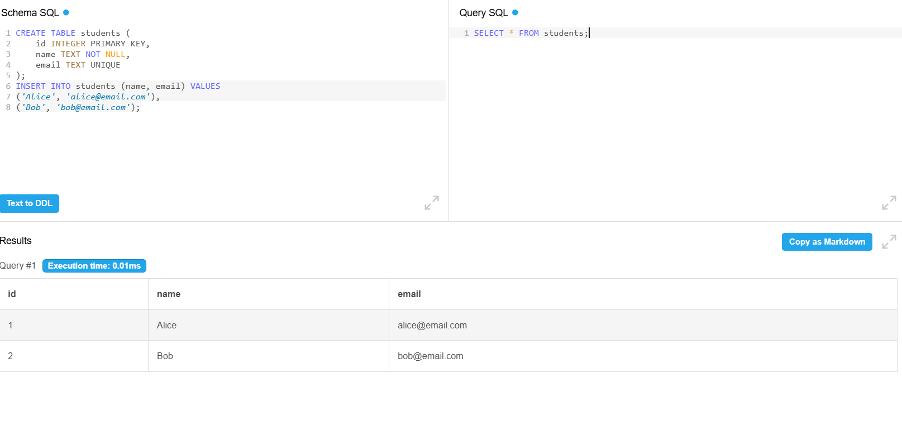
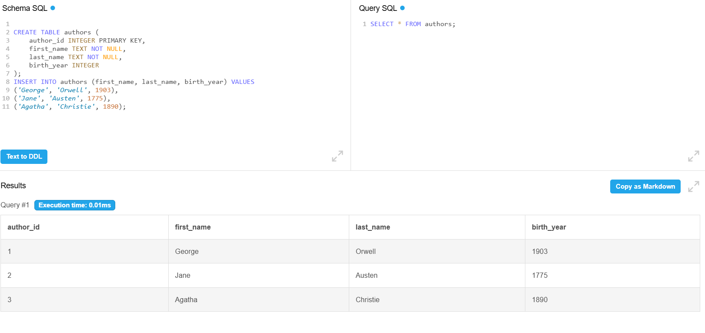
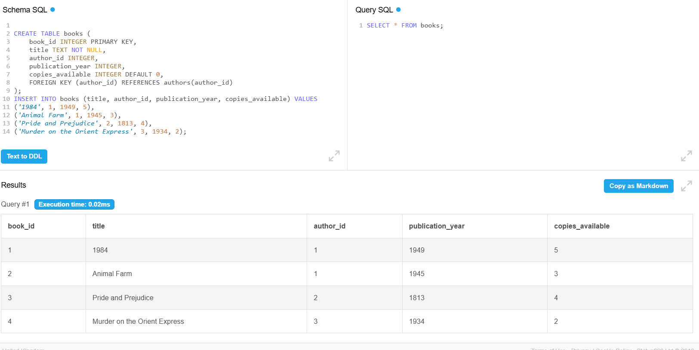
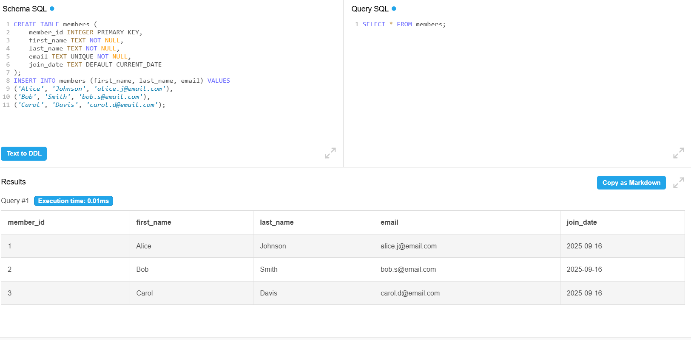
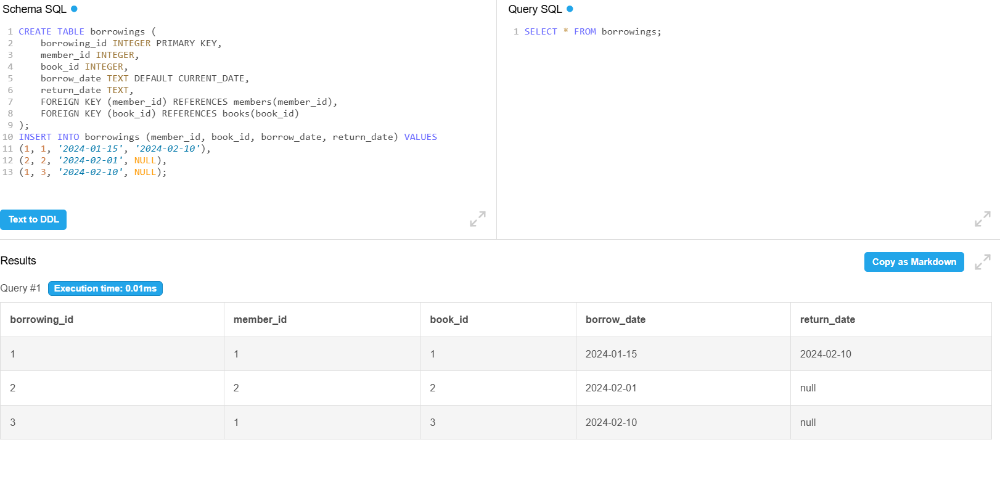
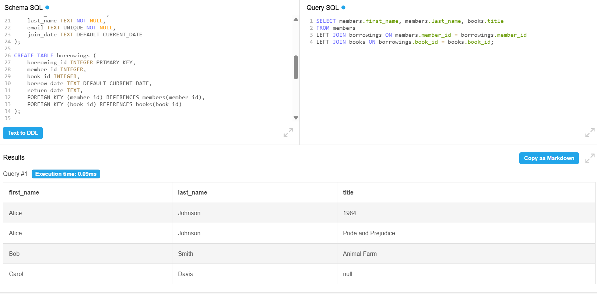
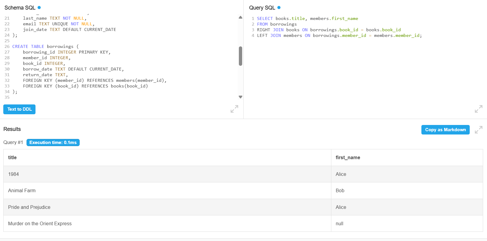
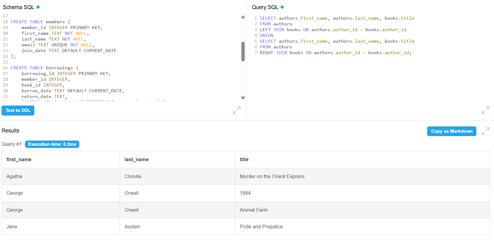
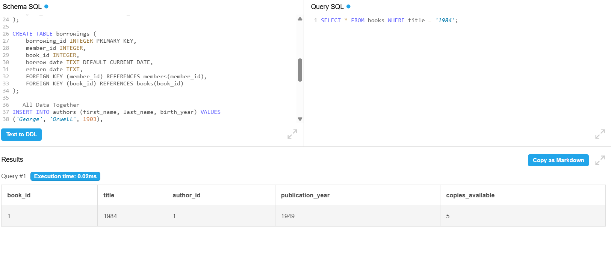
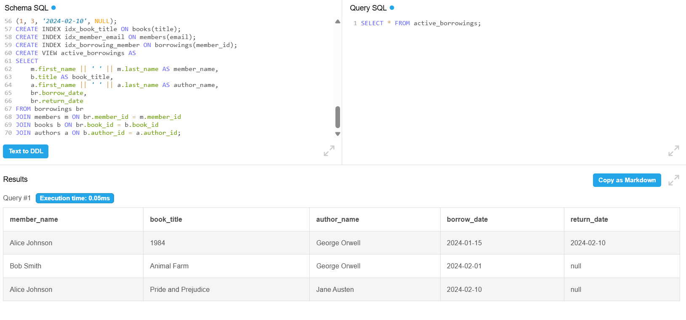

# Group-Work-PL-SQL
## Library Database System - Group Work Report

**Group Members:**  
- Uwase Tracy 27105  
- Munezero Cindy 27121  
- Isimbi Iris 27120  

---

## Executive Summary
Our team successfully designed and implemented a **Library Management Database System** that demonstrates all required database concepts including table creation with constraints, various join operations, indexing for performance optimization, and views for simplified data access.

---

## Tables Created with Constraints
We created 4 interconnected tables with comprehensive constraints:

**Authors Table:**  
- Primary Key: `author_id`  
- NOT NULL: `first_name`, `last_name`  

**Books Table:**  
- Primary Key: `book_id`  
- Foreign Key: `author_id` references Authors  
- NOT NULL: `title`  
- DEFAULT: `copies_available = 0`  

**Members Table:**  
- Primary Key: `member_id`  
- UNIQUE: `email`  
- NOT NULL on essential fields  
- DEFAULT: `join_date = CURRENT_DATE`  

**Borrowings Table:**  
- Primary Key: `borrowing_id`  
- Foreign Keys: `member_id`, `book_id`  
- `return_date` can be NULL  

---

## SQL Tables and Sample Data

**Students Table**
sql
CREATE TABLE students (
    id INTEGER PRIMARY KEY,
    name TEXT NOT NULL,
    email TEXT UNIQUE
);
INSERT INTO students (name, email) VALUES 
('Alice', 'alice@email.com'),
('Bob', 'bob@email.com');

2. Project Tables
Table 1: Authors
CREATE TABLE authors (
    author_id INTEGER PRIMARY KEY,
    first_name TEXT NOT NULL,
    last_name TEXT NOT NULL,
    birth_year INTEGER
);

INSERT INTO authors (first_name, last_name, birth_year) VALUES 
('George', 'Orwell', 1903),
('Jane', 'Austen', 1775),
('Agatha', 'Christie', 1890);

Table 2: Books
CREATE TABLE books (
    book_id INTEGER PRIMARY KEY,
    title TEXT NOT NULL,
    author_id INTEGER,
    publication_year INTEGER,
    copies_available INTEGER DEFAULT 0,
    FOREIGN KEY (author_id) REFERENCES authors(author_id)
);

INSERT INTO books (title, author_id, publication_year, copies_available) VALUES 
('1984', 1, 1949, 5),
('Animal Farm', 1, 1945, 3),
('Pride and Prejudice', 2, 1813, 4),
('Murder on the Orient Express', 3, 1934, 2);

Table 3: Members
CREATE TABLE members (
    member_id INTEGER PRIMARY KEY,
    first_name TEXT NOT NULL,
    last_name TEXT NOT NULL,
    email TEXT UNIQUE NOT NULL,
    join_date TEXT DEFAULT CURRENT_DATE
);

INSERT INTO members (first_name, last_name, email) VALUES 
('Alice', 'Johnson', 'alice.j@email.com'),
('Bob', 'Smith', 'bob.s@email.com'),
('Carol', 'Davis', 'carol.d@email.com');

Table 4: Borrowings
CREATE TABLE borrowings (
    borrowing_id INTEGER PRIMARY KEY,
    member_id INTEGER,
    book_id INTEGER,
    borrow_date TEXT DEFAULT CURRENT_DATE,
    return_date TEXT,
    FOREIGN KEY (member_id) REFERENCES members(member_id),
    FOREIGN KEY (book_id) REFERENCES books(book_id)
);

INSERT INTO borrowings (member_id, book_id, borrow_date, return_date) VALUES 
(1, 1, '2024-01-15', '2024-02-10'),
(2, 2, '2024-02-01', NULL),
(1, 3, '2024-02-10', NULL);

3. JOIN Operations
INNER JOIN (Test 1)
SELECT books.title, authors.first_name, authors.last_name
FROM books
INNER JOIN authors ON books.author_id = authors.author_id;

LEFT JOIN (Test 2)
SELECT members.first_name, members.last_name, books.title
FROM members
LEFT JOIN borrowings ON members.member_id = borrowings.member_id
LEFT JOIN books ON borrowings.book_id = books.book_id;

RIGHT JOIN (Test 3)
SELECT books.title, members.first_name
FROM borrowings
RIGHT JOIN books ON borrowings.book_id = books.book_id
LEFT JOIN members ON borrowings.member_id = members.member_id;

FULL OUTER JOIN (Test 4) - SQLite version
SELECT authors.first_name, authors.last_name, books.title
FROM authors
LEFT JOIN books ON authors.author_id = books.author_id
UNION
SELECT authors.first_name, authors.last_name, books.title
FROM authors
RIGHT JOIN books ON authors.author_id = books.author_id;

4. Index
CREATE INDEX idx_book_title ON books(title);
CREATE INDEX idx_member_email ON members(email);
CREATE INDEX idx_borrowing_member ON borrowings(member_id);

SELECT * FROM books WHERE title = '1984';

5. View
CREATE VIEW active_borrowings AS
SELECT 
    m.first_name || ' ' || m.last_name AS member_name,
    b.title AS book_title,
    a.first_name || ' ' || a.last_name AS author_name,
    br.borrow_date,
    br.return_date
FROM borrowings br
JOIN members m ON br.member_id = m.member_id
JOIN books b ON br.book_id = b.book_id
JOIN authors a ON b.author_id = a.author_id;

SELECT * FROM active_borrowings;

Conclusion

The Library Management Database System demonstrates:

Robust Design: Proper normalization and constraint usage

Optimized Performance: Indexes and efficient queries

User-Friendly Access: Views simplify complex operations

Scalability: Supports growth and expansion

Final Deliverables:

4 normalized tables with constraints

4 JOIN operations with examples

3 performance-optimized indexes

1 multi-table view for simplified access

