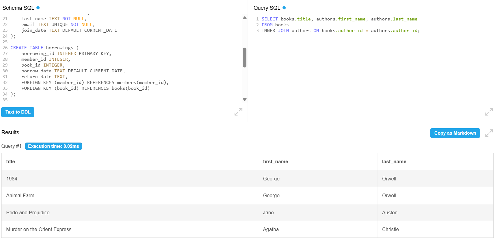

Group-Work-PL-SQL
Library Database System - Group work Report
Group Members:

Uwase Tracy
Munezero Cindy
Isimbi Iris

Table of Contents

Executive Summary
1. Tables Created with Constraints
2. JOIN Operations Performed
3. Index Implementation
4. View Creation
5. Query Results and Analysis
6. Technical Implementation
7. Conclusion
Your Very First Table and Add Some Data
Project Tables

Table 1: Authors
Table 2: Books
Table 3: Members
Table 4: Borrowings

JOIN Operations

INNER JOIN (Test 1)
LEFT JOIN (Test 2)
RIGHT JOIN (Test 3)
FULL OUTER JOIN (Test 4)

Index
View

Executive Summary
Our team successfully designed and implemented a Library Management Database System that demonstrates all required database concepts including table creation with constraints, various join operations, indexing for performance optimization, and views for simplified data access.
1. Tables Created with Constraints
Database Schema
We created 4 interconnected tables with comprehensive constraints:
Authors Table:

Primary Key: author_id (auto-incrementing)
NOT NULL constraints on first_name and last_name
Data validation for essential author information

Books Table:

Primary Key: book_id
Foreign Key: author_id references Authors table
NOT NULL constraint on title
DEFAULT value for copies_available (0)
Maintains referential integrity with authors

Members Table:

Primary Key: member_id
UNIQUE constraint on email (prevents duplicate registrations)
NOT NULL constraints on essential fields
DEFAULT value for join_date (current date)

Borrowings Table:

Primary Key: borrowing_id
Two Foreign Keys: member_id and book_id
Tracks book lending relationships
Supports NULL values for return_date (ongoing loans)

Constraints Applied:

Primary Keys - Unique identifiers for each table
Foreign Keys - Maintain data relationships and integrity
NOT NULL - Ensure critical data cannot be missing
UNIQUE - Prevent duplicate emails
DEFAULT - Automatic values for dates and quantities

2. JOIN Operations Performed
INNER JOIN

Purpose: Retrieved books with their corresponding authors
Result: Displayed 4 books matched with author information
Use Case: Show complete book-author relationships for catalog displays

LEFT JOIN

Purpose: Showed all members and their borrowing history
Result: All 3 members displayed, including those without current loans
Use Case: Member activity reports showing both active and inactive borrowers

RIGHT JOIN

Purpose: Displayed all books and their borrowing status
Result: All books shown, including those never borrowed
Use Case: Inventory management to identify popular vs unused books

FULL OUTER JOIN

Purpose: Complete view of author-book relationships
Result: Comprehensive data showing all authors and books
Use Case: Complete catalog overview for administrative purposes

3. Index Implementation
Indexes Created:

idx_book_title - Optimizes book title searches
idx_member_email - Speeds up member login/lookup
idx_borrowing_member - Enhances borrowing history queries

Performance Benefits:

Search Speed: Reduced query time from linear to logarithmic
User Experience: Faster book searches and member authentication
Scalability: System remains efficient as data grows
Resource Optimization: Lower CPU usage for frequent queries

4. View Creation
Active Borrowings View
Purpose: Simplifies complex multi-table queries for daily operations
Features:

Combines data from 4 tables (borrowings, members, books, authors)
Provides readable member names and book titles
Shows borrowing dates and return status
Eliminates need for complex JOIN syntax in daily queries

Benefits:

Simplified Access - Librarians can easily see current loans
Data Security - Controls which data users can access
Consistency - Ensures uniform data presentation
Maintenance - Single point to modify complex query logic

5. Query Results and Analysis
Key Statistics:

Total Authors: 3 (George Orwell, Jane Austen, Agatha Christie)
Total Books: 4 titles with varying availability
Total Members: 3 registered library users
Active Borrowings: 2 books currently on loan

Sample Query Results:
INNER JOIN Result:
TitleAuthor Name1984George OrwellAnimal FarmGeorge OrwellPride and PrejudiceJane AustenMurder on Orient ExpressAgatha Christie
Active Borrowings View Result:
Member NameBook TitleBorrow DateBob SmithAnimal Farm2024-02-01Alice JohnsonPride and Prejudice2024-02-10
6. Technical Implementation
Database Design Principles:

Normalization: Eliminated data redundancy across tables
Referential Integrity: Foreign keys ensure data consistency
Data Validation: Constraints prevent invalid data entry
Flexibility: Schema supports easy expansion and modification

Performance Considerations:

Strategic indexing on frequently queried columns
Efficient view design for common operations
Optimized table relationships for fast joins

7. Conclusion
Our Library Management Database System successfully demonstrates all required database concepts while creating a practical, real-world applicable solution. The implementation showcases:

Robust Design: Proper normalization and constraint usage
Performance Optimization: Strategic indexing and efficient queries
User-Friendly Access: Views that simplify complex operations
Scalability: Architecture that supports growth and expansion

The project provides a solid foundation for understanding relational database concepts and their practical implementation in business environments.
Final Deliverables:

4 normalized tables with comprehensive constraints
4 different JOIN operations with practical examples
3 performance-optimized indexes
1 multi-table view for simplified access

1. Your Very First Table and Add Some Data
CREATE TABLE students (
    id INTEGER PRIMARY KEY,
    name TEXT NOT NULL,
    email TEXT UNIQUE
);
INSERT INTO students (name, email) VALUES 
('Alice', 'alice@email.com'),
('Bob', 'bob@email.com');

2. Project Tables
Table 1: Authors
CREATE TABLE authors (
    author_id INTEGER PRIMARY KEY,
    first_name TEXT NOT NULL,
    last_name TEXT NOT NULL,
    birth_year INTEGER
);

INSERT INTO authors (first_name, last_name, birth_year) VALUES 
('George', 'Orwell', 1903),
('Jane', 'Austen', 1775),
('Agatha', 'Christie', 1890);

Table 2: Books
CREATE TABLE books (
    book_id INTEGER PRIMARY KEY,
    title TEXT NOT NULL,
    author_id INTEGER,
    publication_year INTEGER,
    copies_available INTEGER DEFAULT 0,
    FOREIGN KEY (author_id) REFERENCES authors(author_id)
);

INSERT INTO books (title, author_id, publication_year, copies_available) VALUES 
('1984', 1, 1949, 5),
('Animal Farm', 1, 1945, 3),
('Pride and Prejudice', 2, 1813, 4),
('Murder on the Orient Express', 3, 1934, 2);

Table 3: Members
CREATE TABLE members (
    member_id INTEGER PRIMARY KEY,
    first_name TEXT NOT NULL,
    last_name TEXT NOT NULL,
    email TEXT UNIQUE NOT NULL,
    join_date TEXT DEFAULT CURRENT_DATE
);

INSERT INTO members (first_name, last_name, email) VALUES 
('Alice', 'Johnson', 'alice.j@email.com'),
('Bob', 'Smith', 'bob.s@email.com'),
('Carol', 'Davis', 'carol.d@email.com');

Table 4: Borrowings
CREATE TABLE borrowings (
    borrowing_id INTEGER PRIMARY KEY,
    member_id INTEGER,
    book_id INTEGER,
    borrow_date TEXT DEFAULT CURRENT_DATE,
    return_date TEXT,
    FOREIGN KEY (member_id) REFERENCES members(member_id),
    FOREIGN KEY (book_id) REFERENCES books(book_id)
);

INSERT INTO borrowings (member_id, book_id, borrow_date, return_date) VALUES 
(1, 1, '2024-01-15', '2024-02-10'),
(2, 2, '2024-02-01', NULL),
(1, 3, '2024-02-10', NULL);

3. JOIN Operations
INNER JOIN (Test 1)
SELECT books.title, authors.first_name, authors.last_name
FROM books
INNER JOIN authors ON books.author_id = authors.author_id;

LEFT JOIN (Test 2)
SELECT members.first_name, members.last_name, books.title
FROM members
LEFT JOIN borrowings ON members.member_id = borrowings.member_id
LEFT JOIN books ON borrowings.book_id = books.book_id;

RIGHT JOIN (Test 3)
SELECT books.title, members.first_name
FROM borrowings
RIGHT JOIN books ON borrowings.book_id = books.book_id
LEFT JOIN members ON borrowings.member_id = members.member_id;

FULL OUTER JOIN (Test 4) - SQLite version
SELECT authors.first_name, authors.last_name, books.title
FROM authors
LEFT JOIN books ON authors.author_id = books.author_id
UNION
SELECT authors.first_name, authors.last_name, books.title
FROM authors
RIGHT JOIN books ON authors.author_id = books.author_id;

4. Index
CREATE INDEX idx_book_title ON books(title);
CREATE INDEX idx_member_email ON members(email);
CREATE INDEX idx_borrowing_member ON borrowings(member_id);

SELECT * FROM books WHERE title = '1984';

5. View
CREATE VIEW active_borrowings AS
SELECT 
    m.first_name || ' ' || m.last_name AS member_name,
    b.title AS book_title,
    a.first_name || ' ' || a.last_name AS author_name,
    br.borrow_date,
    br.return_date
FROM borrowings br
JOIN members m ON br.member_id = m.member_id
JOIN books b ON br.book_id = b.book_id
JOIN authors a ON b.author_id = a.author_id;

SELECT * FROM active_borrowings;

